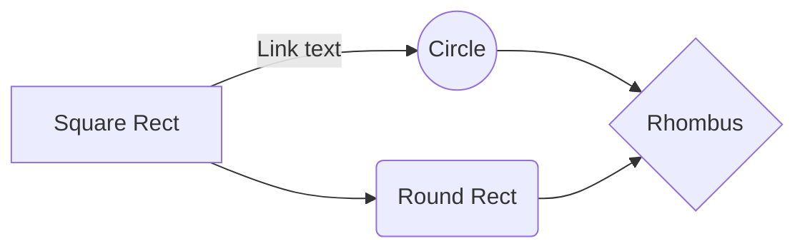

# InstallAnythingWithoutAdminRights

Dans l'environnement de travail Enterprise, vous ne bénéficiez probablement pas des privilèges d'administrateur, mais pour augmenter votre productivité, vous devrez peut-être installer certains kits d'outils logiciels que vous connaissez le mieux.

# Tout se passe dans C:\Users 
``C:\Users\VotreuserName``
Vous devez connaitre votre PATH qui est par defaut :
**``%USERSPROFILE%``**
Pour la plus part des opérations vous devez utiliser le CMD ou le powershell .
Vous devez installer tout les logiciels, SDK ,JDK etc  ici
je Vous recommande ce lien pour plus d'informations :
https://dev.to/davidkou/install-anything-without-admin-rights-4p0j
# Connaitre le PATH 
Allez dans control Panel -> Users Accounts -> Change my environment variables
dans le premier carrée il y'a vos variables d’environnement et dans Path vous devez ajouter une nouvelle ligne pour que vos IDE puissent les détecter , peut être avec un redémarrage de l'ordinateur 

## Installer Python sans être admin

Télécharger l'installateur de Python sur le site officiel
puis :
 
Puis **Install Now**

## Installer .net sans Visual studio
Allez sur : https://learn.microsoft.com/en-us/dotnet/core/tools/dotnet-install-script

et https://dot.net/v1/dotnet-install.ps1
executer le fichier dans cmd ``.\dotnet-install.ps1``
Vous allez devoir travailler avec le .NET CLI ``dotnet`` plus d'infos sur : https://learn.microsoft.com/en-us/dotnet/core/tools/

## Installer Java SDK sans être admin 

Allez sur ce site https://jdk.java.net/archive/
Telecharger la version de votre choix en zip , extraire  puis deplacer le dossier dans c:/Users/XXXXX
Puis dans les variables d'environement donner la localisation du dossier 
ou dans votre IDE donnez sa location plus d'info voir :https://stackoverflow.com/questions/63057245/changing-the-java-home-path-in-vs-code
exemple:``"java.jdt.ls.java.home":"C:\\Users\\******\\jdk-18.0.2",`` **il faut doubler les \\ dans VScode sinon cela ne marchera pas**
Dans VScode , allez dans Gérer ->  Paramètres -> Taper ``Java.Home`` dans la bar puis vous modifier dans ``settings.json`` 

## Petit fichier ps1 a se crée

## Si vous trouvez qu'il manque des infos vous pouvez commit ou pull request 
- The file synchronization will keep one file of the workspace synced with one or multiple files in **Google Drive**, **Dropbox** or **GitHub**.
	> Before starting to sync files, you must link an account in the **Synchronize** sub-menu.

## Open a file

You can open a file from **Google Drive**, **Dropbox** or **GitHub** by opening the **Synchronize** sub-menu and clicking **Open from**. Once opened in the workspace, any 

And this will produce a flow chart:

